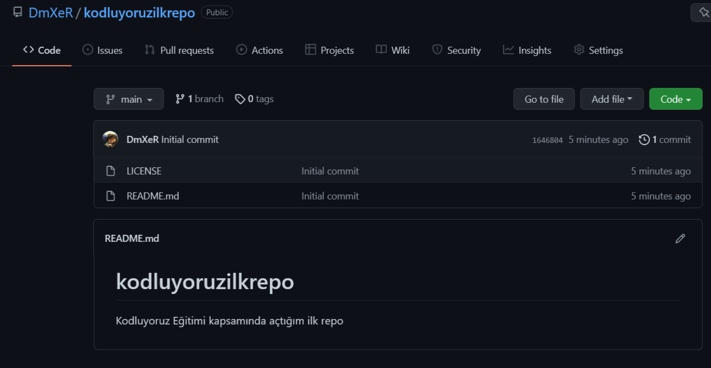

# Kodluyoruz İlk Repo
Bu repo [Kodluyoruz](https://www.kodluyoruz.org) Front-End Eğitiminde oluşturduğumuz ilk repo. İçerisinde bir adet README dosyası ve bir adet index.html barındırıyor.

# Installation
Öncelikle projeyi clonelayın.(Buraya sizin reponuzdan aldığınız link gelecek)

git clone `hhttps://github.com/DmXeR/kodluyoruzilkrepo.git`

# Usage
Projeyi cloneladıktan sonra Visual Studio Code programını açınız.
Linux için:

`cd kodluyoruzilkrepo` 

`code .`

# Contributing
Pull requestler kabul edilir. Büyük değişiklikler için lütfen önce neyi değiştirmek istediğinizi tartışmak için bir konu açınız.

# Licence

[MIT](https://choosealicense.com/licenses/mit/)

Teşekkürler [Patika.dev](https://www.patika.dev/tr) ve [Kodluyoruz](https://www.patika.dev/tr)